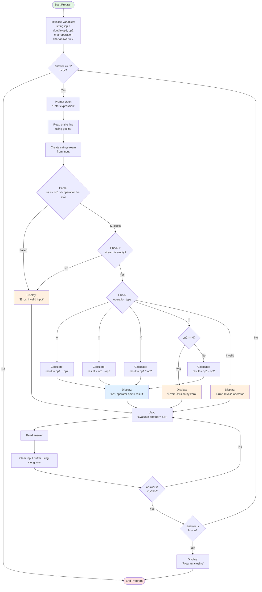

# C++ Basic Calculator - Educational Resource
<p align="center">
  
  
  
  
</p>


**Important Note:** This is a basic CS101-style calculator intended purely for beginner learning. Not a portfolio-level project.

## Overview

This is that basic calculator assignment everyone builds in their first C++ class. I'm uploading this cleaned-up version as a learning resource for beginners who need a reference implementation.

## Quick Start

```bash
git clone https://github.com/jguida941/cpp-calculator-tutorial.git
cd cpp-calculator-tutorial
make
./build/calculator
```

## Why This Repository Exists

This repository exists to demonstrate clear documentation, clean code structure, and fundamental C++ practices, even for a simple beginner exercise. It serves as a reference implementation for students learning C++ fundamentals and addresses common compilation errors that beginners encounter.

## Features

- Four arithmetic operations: addition, subtraction, multiplication, division
- Natural expression input format (e.g., `2 + 2`)
- Decimal number support
- Input validation and error handling
- Continuous operation mode with controlled exit

## Project Structure

> **Note:** This repository may contain additional PyQt or Jupyter Notebook files I'm currently working on. They are unrelated to the calculator project but safe to ignore or run if you're exploring my other work. The file tree below reflects the main calculator structure.

```
Cal/
├── README.md           # This file
├── src/
│   └── calculator.cpp  # Main source code
├── build/             # Compiled executables (generated)
├── examples/          # Example usage
└── Makefile           # Build instructions
```

## Building the Project

### Prerequisites
- C++ compiler (g++ or clang++)
- Make (optional, for using Makefile)

### Option 1: Using Make
```bash
make
```

### Option 2: Direct Compilation
```bash
g++ -o build/calculator src/calculator.cpp
```

### Option 3: With Debugging Symbols
```bash
g++ -g -o build/calculator src/calculator.cpp
```

## Running the Calculator

```bash
./build/calculator
```

### Example Session
```
Enter expression (etc 2 + 2):
5 + 3
5 + 3 = 8
Do you wish to evaluate another expression? (Y/N)
y
Enter expression (etc 2 + 2):
10 / 2
10 / 2 = 5
Do you wish to evaluate another expression? (Y/N)
n
Program closing.
```

## Learning Objectives

This project teaches you to avoid common C++ mistakes:

### Common C++ Pitfalls Addressed
1. **Wrong main signature**: `void main()` → `int main()`
2. **Wrong quotes for chars**: `"Y"` → `'Y'`
3. **Semicolons after if**: `if (condition);` breaks logic flow
4. **Stream operators**: `<<` for output, `>>` for input
5. **Buffer issues**: Not clearing input buffer causes unexpected behavior

### Best Practices Demonstrated
- Input validation before processing
- Clear error messages
- Proper use of `stringstream` for parsing
- Handling edge cases (division by zero)
- Clean loop control with proper exit conditions

## Skills Demonstrated

- **Input/Output Stream Management** - Proper use of `cin`, `cout`, and `getline`
- **String Parsing** - Implementation with `stringstream` for structured input
- **Control Flow** - Conditional statements and loop structures
- **Error Handling** - Division by zero and invalid input validation
- **Buffer Management** - Clearing input stream for robust operation
- **Project Organization** - Structured directories with Makefile build system

## For Students

### Key Concepts to Understand:

1. **String Streams**: How `stringstream` helps parse formatted input
   ```cpp
   stringstream ss(input);
   ss >> op1 >> operation >> op2;  // Extracts values in order
   ```

2. **Input Buffer Management**: Why we need to clear the buffer
   ```cpp
   cin.ignore(numeric_limits<streamsize>::max(), '\n');
   ```

3. **Error Checking**: How to validate user input
   ```cpp
   if (!(ss >> op1 >> operation >> op2) || !ss.eof())
   ```

### Exercises to Try:
- Add support for exponentiation (^)
- Implement parentheses support
- Add memory functions (M+, M-, MR, MC)
- Create a history of calculations
- Add support for more complex expressions

## Implementation Details

### Program Flow Diagram

> **Note:** GitHub automatically renders this Mermaid diagram. If viewing locally, use a Mermaid-compatible markdown viewer.



### Program Flow Summary

The program follows this flow:
1. Initialize variables and start loop
2. Get expression from user
3. Parse the input using stringstream
4. Validate the input format
5. Perform the calculation based on operator
6. Display result
7. Ask if user wants to continue
8. Clear input buffer and repeat or exit

## Additional Resources

- [C++ Reference - Input/Output](https://en.cppreference.com/w/cpp/io)
- [String Streams in C++](https://www.cplusplus.com/reference/sstream/stringstream/)
- [C++ Control Flow](https://en.cppreference.com/w/cpp/language/statements)


## License

Educational use permitted. Students are encouraged to study and modify this code for learning purposes. Not intended for production use - this is purely a learning resource.

---


*Educational reference implementation for C++ beginners*

